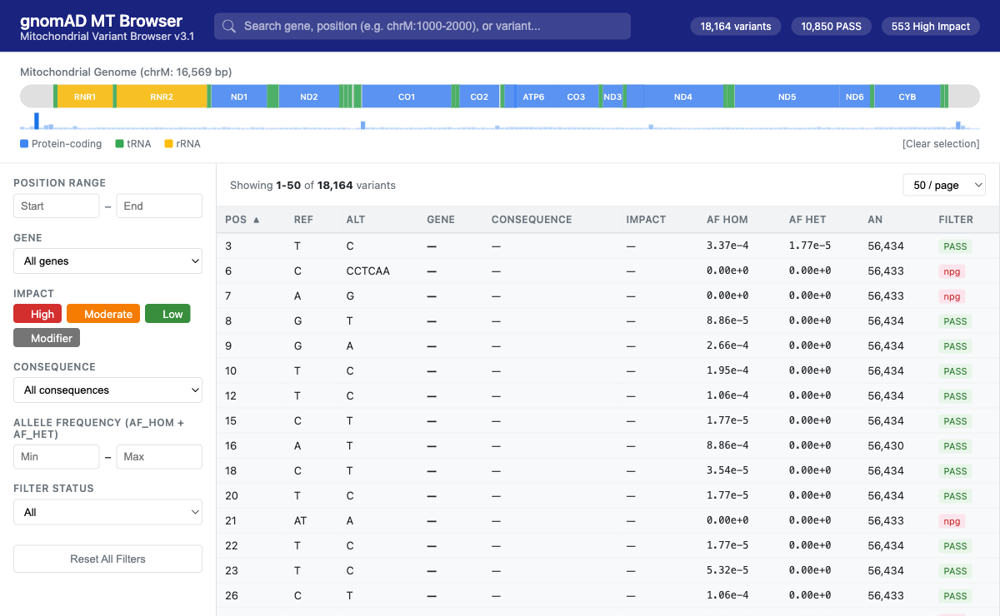
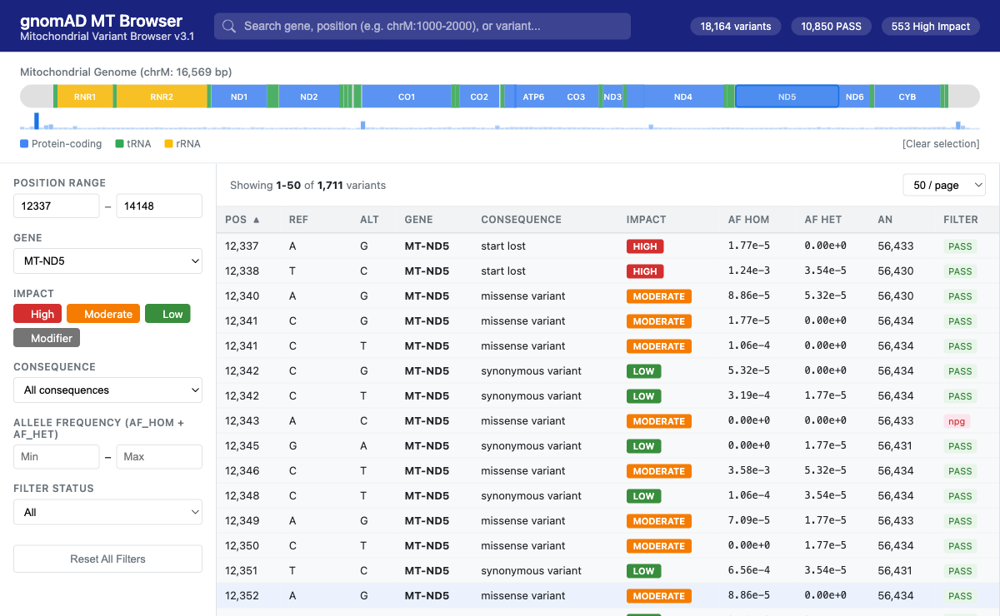
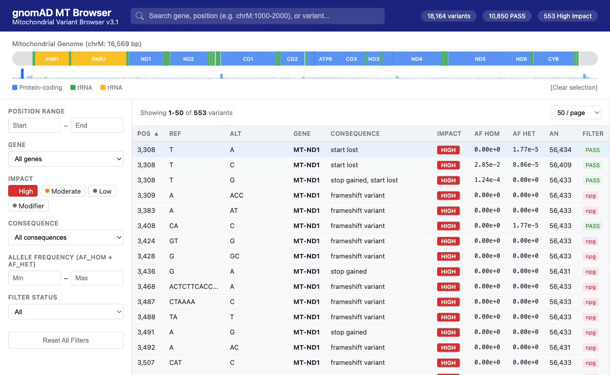
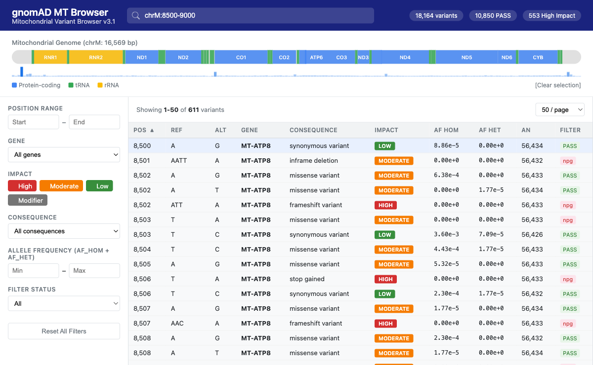
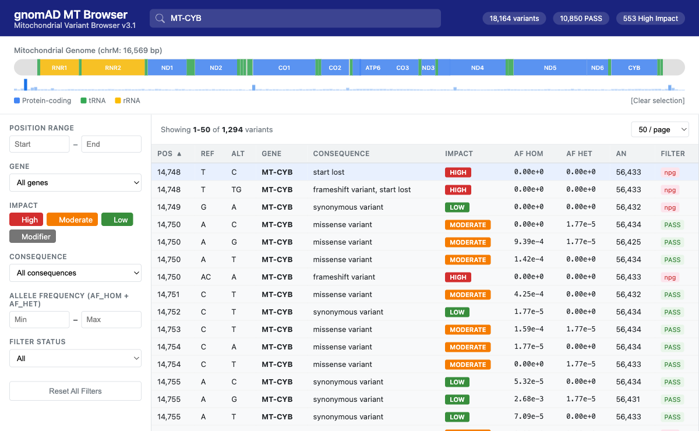
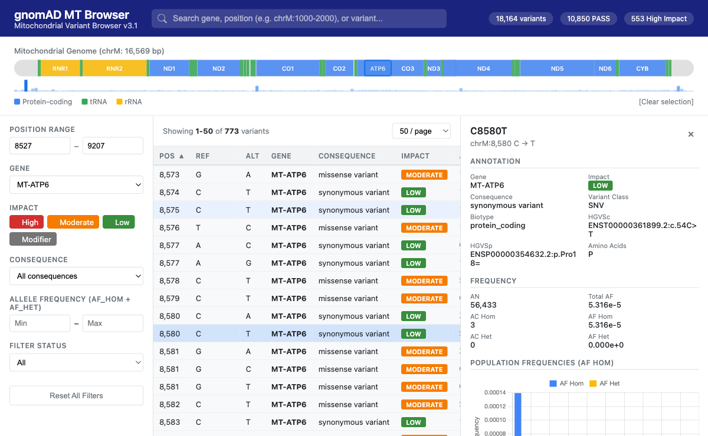
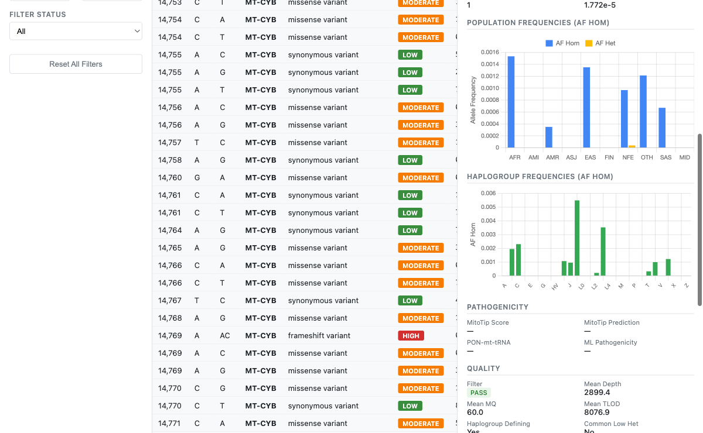
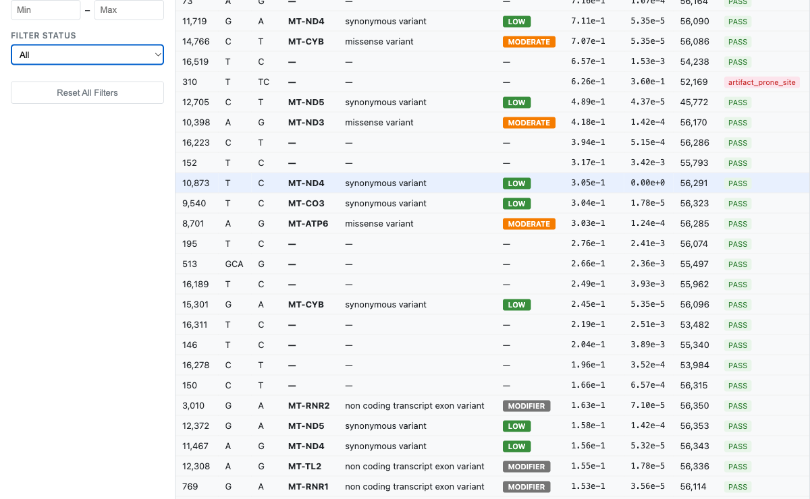

# gnomAD Mitochondrial Variant Browser - Report

## Overview

A web-based genomic variant browser for the gnomAD v3.1 mitochondrial sites VCF. The application parses `gnomad.genomes.v3.1.sites.chrM.vcf.bgz` (18,164 variants across the ~16.5kb mitochondrial genome) and provides an interactive UI for browsing by genomic coordinates, gene, functional impact, allele frequency, and more.

## Architecture

- **Backend**: Flask + pandas, single-process Python server
- **Frontend**: Single-file HTML/CSS/JS with Chart.js (CDN) for visualizations
- **Data**: Parsed at startup from bgzipped VCF into in-memory data structures
- **No build step** required - just Python and a browser

## Files

| File | Description |
|------|-------------|
| `app.py` | Flask backend: VCF parser, REST API (6 endpoints), serves frontend |
| `templates/index.html` | Complete frontend: chromosome map, filters, variant table, detail panel |
| `gnomad.genomes.v3.1.sites.chrM.vcf.bgz` | Input data: gnomAD v3.1 mitochondrial sites VCF |

## How to Run

```bash
cd /Users/jaroslavvitku/workspace/tool
pip install flask flask-cors pandas
python3 app.py
```

Open **http://127.0.0.1:5001** in your browser.

## Dataset Summary

| Metric | Value |
|--------|-------|
| Total variants | 18,164 |
| PASS variants | 10,850 |
| HIGH impact | 553 |
| MODERATE impact | 5,880 |
| LOW impact | 4,953 |
| MODIFIER impact | 3,889 |
| Genes covered | 37 (13 protein-coding, 22 tRNA, 2 rRNA) |
| Populations | 10 (AFR, AMI, AMR, ASJ, EAS, FIN, NFE, OTH, SAS, MID) |
| Haplogroups | 29 (A through Z) |

## API Endpoints

| Endpoint | Description |
|----------|-------------|
| `GET /` | Serve the frontend HTML |
| `GET /api/summary` | Dataset summary: total counts by impact, consequence, filter |
| `GET /api/genes` | Gene list with coordinates and variant counts |
| `GET /api/density` | Variant density histogram (200 bins across chrM) |
| `GET /api/variants` | Paginated, filterable, sortable variant list |
| `GET /api/variant/<pos>/<ref>/<alt>` | Full variant detail with population & haplogroup data |
| `GET /api/filters` | Available filter values for dropdowns |

### Variant Query Parameters

The `/api/variants` endpoint supports:

- `pos_start`, `pos_end` - Position range filter
- `gene` - Gene name filter (comma-separated for multiple)
- `consequence` - VEP consequence type
- `impact` - Impact level (comma-separated: HIGH,MODERATE,LOW,MODIFIER)
- `af_min`, `af_max` - Allele frequency range
- `filter` - VCF filter status (PASS, etc.)
- `search` - Free text search (gene name, position, coordinates like `chrM:1000-2000`)
- `sort_by`, `sort_order` - Column sorting
- `page`, `per_page` - Pagination

## Features

### 1. Chromosome Map

Interactive horizontal bar showing the full mitochondrial genome (16,569 bp) with color-coded gene regions:
- Blue: protein-coding genes (ND1-6, CO1-3, ATP6, ATP8, CYB)
- Green: tRNA genes (22 genes)
- Yellow: rRNA genes (RNR1, RNR2)

A variant density track below shows the distribution of variants across the genome. Clicking a gene filters the table to that gene's region and highlights the selection.



### 2. Filter Panel

Left sidebar with multiple filter controls:
- **Position range**: numeric start/end inputs
- **Gene dropdown**: all 37 MT genes
- **Impact toggles**: clickable color-coded buttons (HIGH=red, MODERATE=orange, LOW=green, MODIFIER=gray)
- **Consequence dropdown**: 22 VEP consequence types
- **Allele frequency range**: min/max inputs
- **Filter status**: All or PASS only
- **Reset All Filters** button

### 3. Variant Table

Sortable, paginated table displaying:
- Position, Ref, Alt, Gene, Consequence, Impact (color-coded badge), AF Hom, AF Het, AN, Filter status
- Click any column header to sort (ascending/descending toggle)
- Configurable page size (25, 50, 100, 200)
- Click any row to open the detail panel

### 4. Gene Filtering via Chromosome Map

Clicking a gene block on the chromosome map automatically:
- Sets position range to the gene coordinates
- Selects the gene in the dropdown
- Shows a blue selection overlay on the map
- Filters the variant table



### 5. Impact Filtering

Toggle impact levels to focus on specific variant classes:



### 6. Coordinate Search

Type `chrM:8500-9000` in the search box to jump to a specific region:



### 7. Gene Name Search

Type a gene name to filter by text match:



### 8. Variant Detail Panel

Click any variant row to open a slide-out detail panel showing:

**Annotation**: gene, impact, consequence, variant class, biotype, HGVSc, HGVSp, amino acid change

**Frequency**: AN, total AF, AC/AF for homoplasmic and heteroplasmic calls

**Population Frequencies**: bar chart comparing AF Hom and AF Het across 10 populations (AFR, AMI, AMR, ASJ, EAS, FIN, NFE, OTH, SAS, MID)

**Haplogroup Frequencies**: bar chart showing AF Hom across 29 haplogroups

**Pathogenicity**: MitoTip score and prediction, PON-mt-tRNA prediction, ML probability of pathogenicity

**Quality**: filter status, mean depth, mean mapping quality, mean TLOD, haplogroup-defining flag, common low heteroplasmy flag





### 9. Sorting

Click column headers to sort by any field. Example - sorting by AF Hom descending to find the most common variants:



## Data Parsed from VCF

For each of the 18,164 variants, the following fields are extracted:

**Core**: chrom, pos, ref, alt, filter

**Allele counts**: AN, AC_hom, AC_het, AF_hom, AF_het

**VEP annotation**: consequence, impact, symbol (gene), gene_id, biotype, HGVSc, HGVSp, protein_position, amino_acids, codons, variant_class, SIFT, PolyPhen, LoF

**Population data** (per population): AN, AC_hom, AC_het, AF_hom, AF_het

**Haplogroup data** (per haplogroup): AN, AC_hom, AF_het, AF_hom

**Pathogenicity**: mitotip_score, mitotip_trna_prediction, pon_mt_trna_prediction, pon_ml_probability_of_pathogenicity

**Quality**: dp_mean, mq_mean, tlod_mean, excluded_AC

**Flags**: hap_defining_variant, common_low_heteroplasmy

## Technology Stack

| Component | Technology |
|-----------|-----------|
| Backend | Python 3.13, Flask 3.0, flask-cors |
| Data handling | pandas, gzip (native bgzf reading) |
| Frontend | Vanilla HTML/CSS/JS (no framework) |
| Charts | Chart.js 4.4 (CDN) |
| Layout | CSS Grid, Flexbox |
